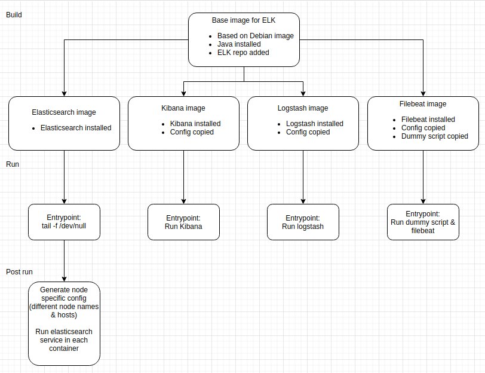
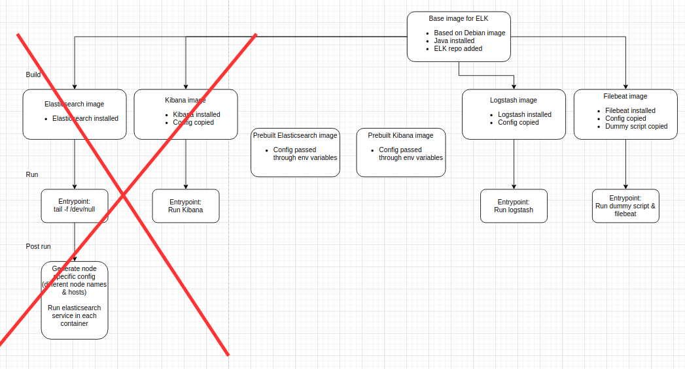

### Requirements  
 - `Docker`
 - `docker-compose`

### Installation and startup

```
# clone the repo
git clone https://github.com/Gleb-Komissarov/code.git
# set max virtual memory areas to meet elasticsearch requirements
sudo sysctl -w vm.max_map_count=262144
# build images and run containers   
docker-compose up
```

Kibana can be accessed at `localhost:5601`

### Requirements met
 - Software versions ✓
 - OS ✓
 - Own Dockerfiles ✗/✓ (For half of the services)
 - 3 node ES cluster ✓
 - Servers in same network ✓
 - Logstash listening on 5042 ✓
 - Logstash can write to ES ✓
 - Kibana listening on public interface ✓
 - Kibana can read from ES ✓
### Bonus requirements met
 - Container life automation ✓
 - Monitoring ✗
 - Backup approach ✗
 - TLS ✗

### Initial plan



### Actual result


Unfortunately, I was unable to build Kibana & Elasticsearch images myself due to various networking errors. :(  
Attempts are left in `deprecated` directory. :^)
